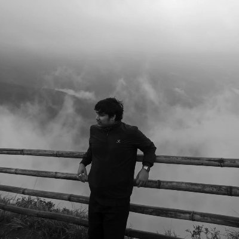
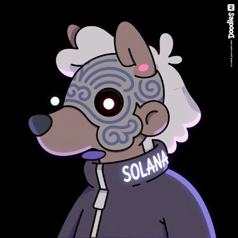

  
  <h1>Chaos Labs</h1>
  
A team of core Solana engineers building high-performance infrastructure and applications on Solana.

---

### Products

**[ordr.trade](https://ordr.trade)**

A fully on chain order book exchange on Solana that gives market makers their own private accounts, cheap repricing, and protection from toxic arbitrage. The result: tighter spreads and better prices for everyone.

---

## Team

<table>
  <tr>
    <td align="center" width="200">
       
      <strong>Arjun</strong>
    </td>
    <td>
      <ul>
        <li>Contributed to Solana's main client validator and core protocols: MagicBlock, Blueshift, Tapedrive</li>
        <li>Built lotry.fun, $50k+ in volume</li>
        <li>11+ hackathon wins</li>
      </ul>
    </td>
  </tr>
  <tr>
    <td align="center">
       
      <strong>Avhi</strong>
    </td>
    <td>
      <ul>
        <li>Contributed to Solana's main client validator and core protocols: Mollusk, Anchor, Blueshift, Alphenglow</li>
        <li>Won Solana Privacy Hack (global)</li>
        <li>Deep expertise in kernels, validators, and low-level Solana</li>
      </ul>
    </td>
  </tr>
  <tr>
    <td align="center">
       
      <strong>Manu</strong>
    </td>
    <td>
      <ul>
        <li>Contributed to Solana Foundation OSS: Anchor, Blueshift</li>
        <li>Shipped Solana client extension for improved local transaction simulation</li>
        <li>Deep expertise in validators, core infra, networking, and low-level Solana</li>
      </ul>
    </td>
  </tr>
  <tr>
    <td align="center">
       
      <strong>Vinaya</strong>
    </td>
    <td>
      <ul>
        <li>One of the few engineers writing sBPF assembly on Solana</li>
        <li>Contributed to Blueshift, Anchor</li>
        <li>4+ years as a core Solana engineer</li>
      </ul>
    </td>
  </tr>
</table>
